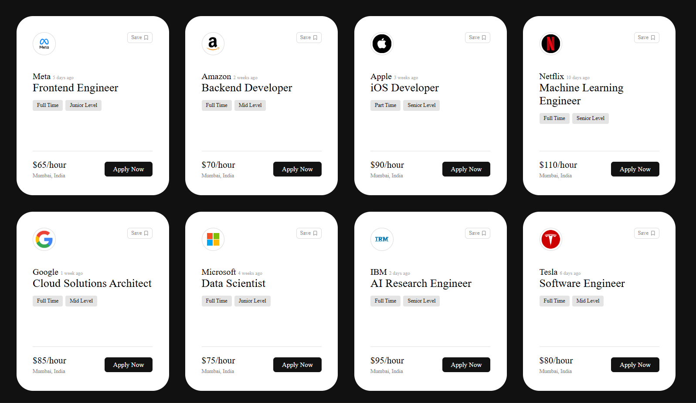

# Job Listings UI

A professional **Job Listings Interface** built using **React** to practice and demonstrate fundamental concepts such as **props**, **array mapping**, and **component-based architecture**.

This project simulates a real-world job board UI where multiple job cards are rendered dynamically from structured data.

---

## Overview

The primary goal of this project was to understand how modern frontend applications handle repeated UI elements using reusable components and data-driven rendering.

Each job listing is generated from a JavaScript object and displayed through a reusable React component, ensuring clean code, scalability, and maintainability.

---

## Key Features

* Reusable and scalable **Job Card** component
* Dynamic rendering using **Array.map()**
* Data flow handled via **props**
* Clean, modern UI inspired by real job platforms
* Responsive card layout

---

## Technical Concepts Covered

* Component-based design in React
* Passing and consuming props
* Rendering lists efficiently
* Separation of data and presentation logic
* JSX structure and styling

---

## Tech Stack

* React
* JavaScript (ES6+)
* CSS
* Vite

---

## Preview

---

## Purpose

This project was created as part of learning and reinforcing **core React fundamentals**, particularly how to build reusable components and render UI dynamically based on data.

---

## Author

Ankit Barmola
